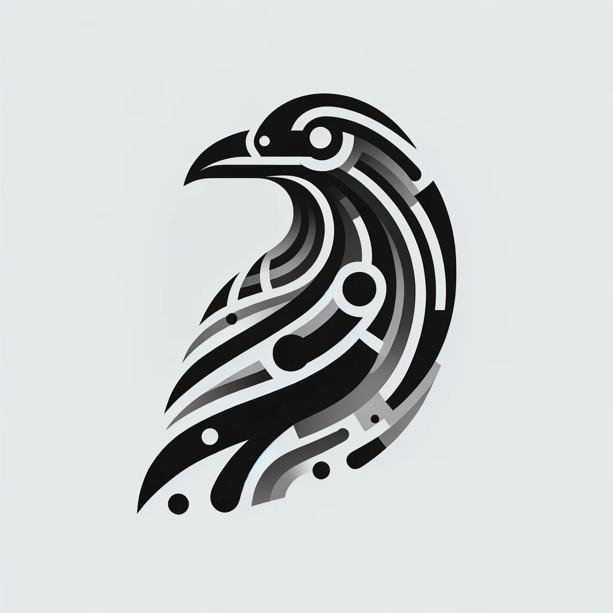

<p align="center">
  
</p>

[circleci-image]: https://img.shields.io/circleci/build/github/nestjs/nest/master?token=abc123def456
[circleci-url]: https://circleci.com/gh/nestjs/nest

## Description

Raven is a knowledge management tool that leverages ai to summarize and organize articles. It allows users to save articles, automatically generate summaries, and tag content for easy searching later. The tool supports both local and external database storage options, making it versatile for different user needs.

## Installation

```bash
$ npm install
```

## Prerequisites

This repo utilizes [Taskfile](https://taskfile.dev/) for task management and runners. See the [installation page](https://taskfile.dev/installation/) for several installation options.

## Running the app

```bash
# development
$ task start
```

## Test

```bash
# unit tests
$ task testUnit

# e2e tests
$ task testE2e
```
