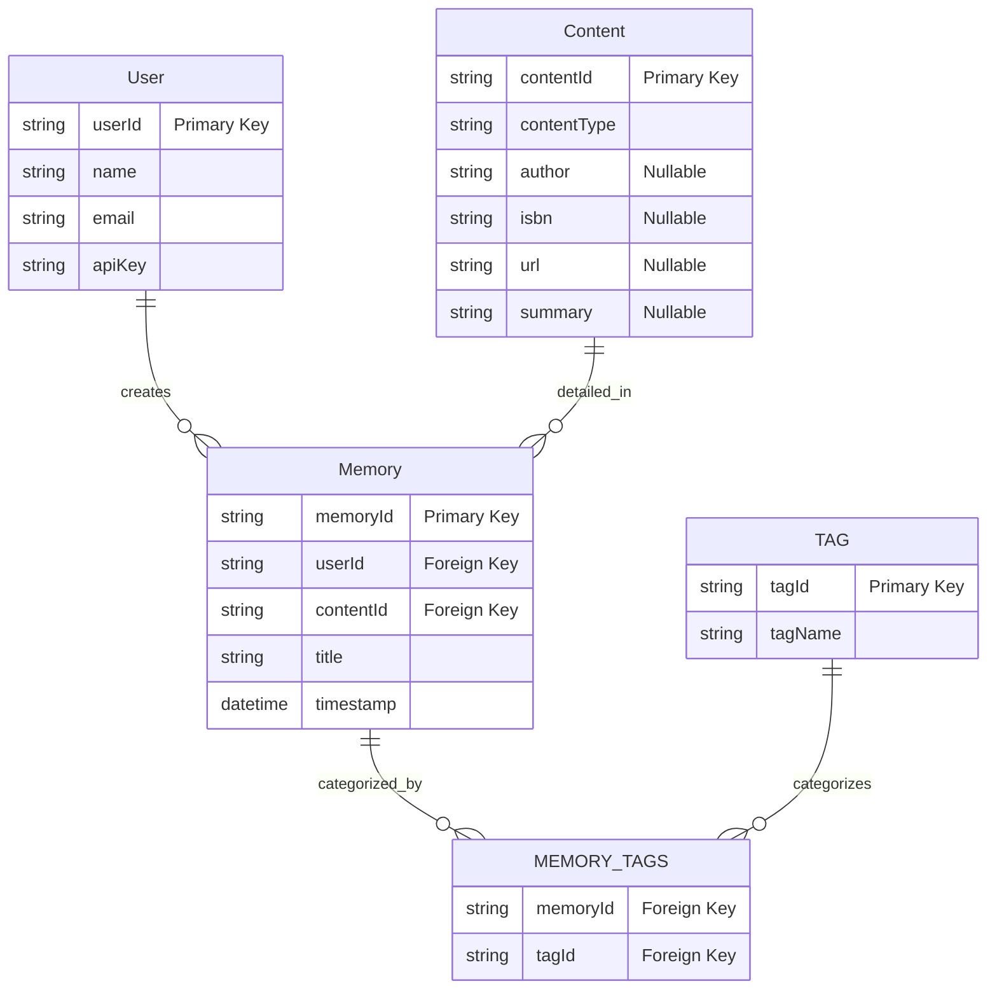

# Initial Design

## Database Schema

With this design, article, podcast, book all become invariants of the "content" model in our domain.

## API

General design - not all routes below have to exist.

### Memories

- List Memories: GET /memories
- Create Memory: POST /memories
- Get Memory: GET /memories/{memoryId}
- Update Memory: PUT /memories/{memoryId}
- Delete Memory: DELETE /memories/{memoryId}

### Books

- Create a Book Memory: POST /memories/books
- Get a Book Memory: GET /memories/books/{memoryId}
- Update a Book Memory: PUT /memories/books/{memoryId}
- Delete a Book Memory: DELETE /memories/books/{memoryId}

### Articles

- Create an Article Memory: POST /memories/articles
- Get an Article Memory: GET /memories/articles/{memoryId}
- Update an Article Memory: PUT /memories/articles/{memoryId}
- Delete an Article Memory: DELETE /memories/articles/{memoryId}

### Podcasts

- Create a Podcast Memory: POST /memories/podcasts
- Get a Podcast Memory: GET /memories/podcasts/{memoryId}
- Update a Podcast Memory: PUT /memories/podcasts/{memoryId}
- Delete a Podcast Memory: DELETE /memories/podcasts/{memoryId}
